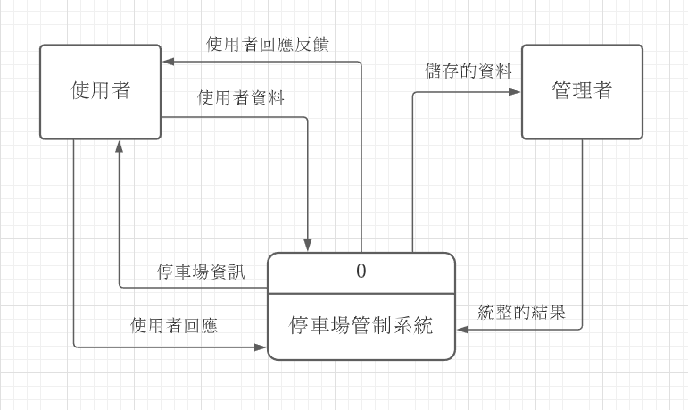

# 2020_OO

## 姓名：陳靖慈    學號：C107118126    班級：資管三A

### 組別：第12組

#### 成員：黃琦雯(PM)  陳靖慈(組長、前端)  粘子恩(後端)

##### 題目：停車場管制系統

##### 摘要：可以透過此系統尋找空位，也可以辨識機車停在哪一個機車格內

---
`
甘特圖
`

---
`
PERT/CPM圖
`

---
功能性需求
* 定位：能夠在使用者找不到機車的狀況下來協助找尋機車。
* 停車空位：有效避免花費時間來尋找停車空位，並且減少違停人數。
* 管理車位：幫助校方即時確認是否有需要增設車位的需求。

非功能性需求
* 即時性：系統可以即時反饋停車場空位及機車位置。
* 使用性：使用者不避花費大量的時間來學習使用此系統，只需安裝定位器以及下載。
* 準確性：可以有避免誤觸隔壁車位的裝置。
---
`
FDD圖
`

---
`
需求分析
`

停車場管制系統的需求分析簡述如下：

1.任何數據必須即時更新。

2.使用者需先做「定位器設定」與「RFID裝置」，才能感測停車的所在地點以及偵測停車場空位。

3.管理者再藉由「連接停車場感測裝置」來產生現有車位分佈狀況。

4.使用者可以藉由「現有車位」檢視目前現有車位的位置。

5.使用者可以藉由「GPS定位」查看車輛在哪裡。

6.提供「檢舉違規行為」，任何違規行為可在此提供相關資訊，以便我們連絡相關單位處理。

7.提供「聯絡我們」，如果使用者有操作或者系統上的問題都可以在這裡告訴我們。

---
`
使用案例圖
`

---
`
使用案例說明
`

|使用案例名稱|查詢機車位置|
|:-------------|:---------------|
|行動者|使用者|
|說明|描述查詢機車停車位置過程|
|完成動作|1.點擊車輛定位查詢 2.連接定位器 3.GPS定位 4.系統顯示車輛位置|
|替代方法|1.點擊車輛定位查詢 2.連接定位器 3.GPS無法連接 4.系統顯示GPS無法連接|
|先決條件|機車停入空車位，連接定位器，並開啟手機GPS定位|
|後置條件|使用者尋找自己車輛離去|
|假設|無|

|使用案例名稱|尋找停車空位|
|:------------|:---------|
|行動者|使用者|
|說明|描述查詢停車空位過程|
|完成動作|1.使用者點選查詢現有空位 2.系統連接RFID尋找空位 3.RFID連接成功 4.系統顯示現有空位|
|替代方法|1.使用者點選查詢現有空位 2.系統連接RFID尋找空位 3.RFID無法連接 4.系統顯示RFID無法連接|
|先決條件|車位加裝RFID感應車位|
|後置條件|回傳至系統，使用者停入車位|
|假設|無|

|使用案例名稱|檢舉違規行為|
|:------------|:---------|
|行動者|使用者|
|說明|描述檢舉違規行為過程|
|完成動作|1.使用者點選檢舉 2.使用者選取照片，以及撰寫文字 3.系統接收檢舉 4.管理者通過檢舉|
|替代方法|1.使用者點選檢舉 2.使用者選取照片，以及撰寫文字 3.系統接收檢舉 4.管理者未通過檢舉|
|先決條件|有機車違規停車|
|後置條件|違規者罰款|
|假設|無|

---
`
DFD圖
`

---
`
DFD圖0
`

---
`
UML 類別圖
`

---
`
循序圖
`

---
`
活動圖
`

